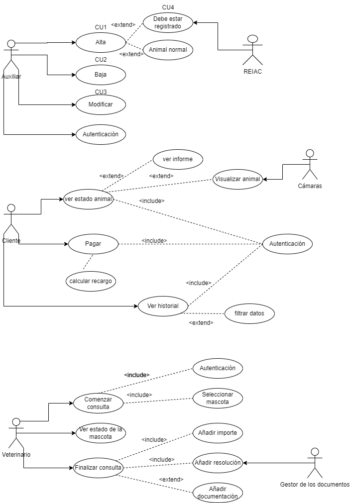

# Tarea Clinica Veterinaria: Informe

**Nombre:** Marlon Farizo Hergueta.

**Curso:** 1º Desarrollo de Aplicaciones Web.

**Asignatura:** Entornos de desarrollo.

### ÍNDICE

+ [Datos generales](#id1)
+ [Auxiliares](#id2)
+ [Veterinario](#id3)
+ [Cliente](#id4)
+ [Diagrama](#id5)

### Datos generales  
Como datos generales tenemos varias cosas a tener en cuenta:
En primer lugar la clínica Veterinaria debe de almacenar datos tanto de el veterinario y el auxiliar para autentificarse, como de sus clientes que se pedira nombre, apellidos, DNI, fecha de nacimiento y teléfono o email.
También debe almacenar datos de las mascotas de cada dueño, teniendo en cuenta que cada cliente puede tener varias mascotas, pero cada mascota solo puede pertenecer a un dueño, dando la posibilidad a cambiar de dueño en caso de que así se requiera.
Las recetas y otros documentos seran incluidos en un gestor de contenidos que ya esta en funcionamiento.

### Auxiliares  
Los auxiliares en un principio tendran que registrarse para poder usar la aplicación.
Los datos son introducidos y gestionados por los auxiliares.
Tendran que dar de alta a los animales que entren en consulta, en caso de que el animal tenga que estar identificado tendra que buscar en los registro del REIAC para comprobar que esta dado de alta correctamente.
El auxiliar también podra dar de baja a los animales al finalizar las consultas.

### Veterinario  
El veterinario también tendra que registrarse para usar la aplicación.
Cada vez que hace una consulta, esta queda registrada almacenando el tiempo de consulta, identificación del veterinario, el animal tratado, el importe total, la resolucion y la receta.
Para calcular el tiempo de la consulta el veterinario tendra un boton que pulsara al comenzar la consulta y volvera a pulsar para parar el tiempo al finalizarla, asi se sabra el tiempo empleado.

### Cliente  
El cliente se registrara para poder acceder a varios apartados:
En caso de que el animal se quede ingresado, el cliente puede acceder al estado en tiempo real del animal por una cámara, por la cual podra comunicarse con el animal y ver su estado. Este servicio de cámaras sera dado por una aplicación que ya esta implementada.
Podra acceder a los datos de su animal como la receta, el importe, el estado y ver todo el historial de sus mascotas.
El cliente no tiene porque hacer el pago inmediato, podra hacer el pago por la aplicación web y en caso de que tarde más de una semana se efectuará un recargo sobre el precio inicial.

### Diagrama  
