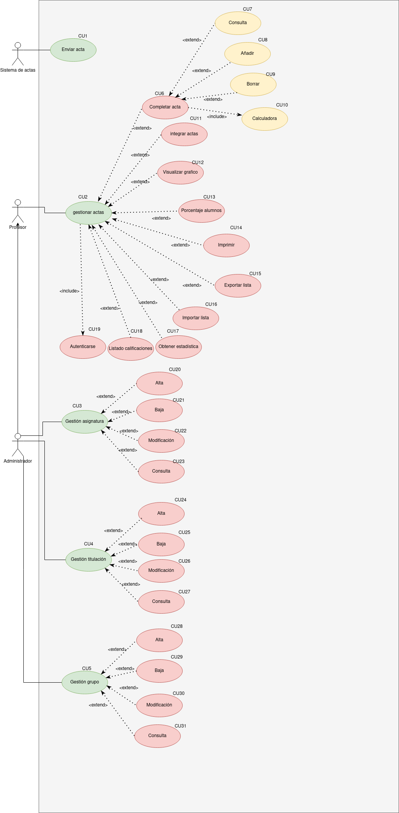

## Índice
  - [Introducción](#introducción).
  - [Descripción](#descripción).
  - [Especificación de actores](#especificación-de-actores).
  - [Especificación de casos de uso](#especificación-de-casos-de-uso).

### Introducción

  El presente documento especifica el __diagrama de casos de uso__ de la aplicación __Gestión centro profesores__ solicitada por un instituto que quiere admnistrar las actas del centro

### Descripción

  Lafinalidad de este proyecto es hacer es pasar el formato papel al formato digital.

### Especificación de Actores

  En este documento se muestran los diferentes actores que utilizarán la aplicación.

  ### Sistema de actas

| Actor | Sistema de actas |
  |---|---|
  | Descripción  | Sistema que enviara las actas a la aplicación  |
  | Características  | Envia las actas que seran tratadas por los profesores |
  | Relaciones |   |
  | Referencias | |   
  |  Notas |   |
  | Autor  | _Marlon Farizo Hergueta_ |
  |Fecha | _03/02/2023_ |

### Profesor

  | Actor | Profesor |
  |---|---|
  | Descripción  | Los encargados de comprobar gestionar las actas de los alumnos |
  | Características  | Podran manipular las actas de los alumnos |
  | Relaciones |   |
  | Referencias | |   
  |  Notas |   |
  | Autor  | _Marlon Farizo Hergueta_ |
  |Fecha | _03/02/2023_ |

### Administrador

  | Actor | Administrador |
  |---|---|
  | Descripción  | Responsables de manipular las actas, asignaturas, titulaciones y grupos  |
  | Características  | pueden hacer lo mismo que el profesor, pero tiene permisos extras |
  | Relaciones | Se relaciona con el profesor, ya que puede hacer lo mismo, lo que el administrador tendra aparte unos permisos extras  |
  | Referencias | |   
  |  Notas |   |
  | Autor  | _Marlon Farizo Hergueta_ |
  |Fecha | _03/02/2023_ |

  ### Especificación de Casos de uso

|  Caso de Uso	CU.1 | Enviar actas |
|---|---|
| Fuentes  | El caso de uso se sustenta en [este documento](https://github.com/jpexposito/ets/tree/main/diagramas-comportamiento/diagramas-cu/tareas/tarea7).  |
| Actor  | Sistema de actas  |
| Descripción |  Envia las actas que van a ser tratadas |
| Flujo básico |  |
| Pre-condiciones |  |  
| Post-condiciones  | |  
|  Requerimientos |  |
|  Notas |  |
| Autor  | _Marlon Farizo Hergueta_ |
|Fecha | _03/02/23_ |

|  Caso de Uso	CU.2 | Gestionar actas |
|---|---|
| Fuentes  | El caso de uso se sustenta en [este documento](https://github.com/jpexposito/ets/tree/main/diagramas-comportamiento/diagramas-cu/tareas/tarea7).  |
| Actor  | Profesor  |
| Descripción | Abarca todas las funciones que pueden hacer los profesores con las actas  |
| Flujo básico |  |
| Pre-condiciones | Autenticarse |  
| Post-condiciones  | |  
|  Requerimientos | Autenticarse  |
|  Notas |  |
| Autor  | _Marlon Farizo Hergueta_ |
|Fecha | _03/02/23_ |

|  Caso de Uso	CU.3 | Gestionar asignatura |
|---|---|
| Fuentes  | El caso de uso se sustenta en [este documento](https://github.com/jpexposito/ets/tree/main/diagramas-comportamiento/diagramas-cu/tareas/tarea7).  |
| Actor  | Administrador  |
| Descripción | Abarca las funciones que se pueden hacer con las asignaturas  |
| Flujo básico |  |
| Pre-condiciones |  |  
| Post-condiciones  | |  
|  Requerimientos |  |
|  Notas |  |
| Autor  | _Marlon Farizo Hergueta_ |
|Fecha | _03/02/23_ |

|  Caso de Uso	CU.4 | Gestionar titulaciones |
|---|---|
| Fuentes  | El caso de uso se sustenta en [este documento](https://github.com/jpexposito/ets/tree/main/diagramas-comportamiento/diagramas-cu/tareas/tarea7).  |
| Actor  | administrador  |
| Descripción | Abarca las funciones que se pueden hacer con las titulaciones  |
| Flujo básico |  |
| Pre-condiciones |  |  
| Post-condiciones  | |  
|  Requerimientos |  |
|  Notas |  |
| Autor  | _Marlon Farizo Hergueta_ |
|Fecha | _03/02/23_ |

|  Caso de Uso	CU.5 | Gestionar grupo |
|---|---|
| Fuentes  | El caso de uso se sustenta en [este documento](https://github.com/jpexposito/ets/tree/main/diagramas-comportamiento/diagramas-cu/tareas/tarea7).  |
| Actor  | Sistema de actas  |
| Descripción | Abarca las funciones que se pueden hacer con los grupos  |
| Flujo básico |  |
| Pre-condiciones |  |  
| Post-condiciones  | |  
|  Requerimientos |  |
|  Notas |  |
| Autor  | _Marlon Farizo Hergueta_ |
|Fecha | _03/02/23_ |

|  Caso de Uso	CU.6 | Completar actas |
|---|---|
| Fuentes  | El caso de uso se sustenta en [este documento](https://github.com/jpexposito/ets/tree/main/diagramas-comportamiento/diagramas-cu/tareas/tarea7).  |
| Actor  | profesor  |
| Descripción | Abarca las acciones que se te permiten completar las actas de los alumnos  |
| Flujo básico |  |
| Pre-condiciones |  |  
| Post-condiciones  | |  
|  Requerimientos |  |
|  Notas |  |
| Autor  | _Marlon Farizo Hergueta_ |
|Fecha | _03/02/23_ |

|  Caso de Uso	CU.7 | Consulta |
|---|---|
| Fuentes  | El caso de uso se sustenta en [este documento](https://github.com/jpexposito/ets/tree/main/diagramas-comportamiento/diagramas-cu/tareas/tarea7).  |
| Actor  | Profesor  |
| Descripción | Se pueden consultar los datos de los alumnos  |
| Flujo básico |  |
| Pre-condiciones |  |  
| Post-condiciones  | |  
|  Requerimientos |  |
|  Notas |  |
| Autor  | _Marlon Farizo Hergueta_ |
|Fecha | _03/02/23_ |

|  Caso de Uso	CU.8 | Añadir |
|---|---|
| Fuentes  | El caso de uso se sustenta en [este documento](https://github.com/jpexposito/ets/tree/main/diagramas-comportamiento/diagramas-cu/tareas/tarea7).  |
| Actor  | Profesor  |
| Descripción | Permite añadir actas de alumnos  |
| Flujo básico |  |
| Pre-condiciones |  |  
| Post-condiciones  | |  
|  Requerimientos |  |
|  Notas |  |
| Autor  | _Marlon Farizo Hergueta_ |
|Fecha | _03/02/23_ |

|  Caso de Uso	CU.9 | Borrar |
|---|---|
| Fuentes  | El caso de uso se sustenta en [este documento](https://github.com/jpexposito/ets/tree/main/diagramas-comportamiento/diagramas-cu/tareas/tarea7).  |
| Actor  | Profesor  |
| Descripción | Permite borrar actas de alumnos  |
| Flujo básico |  |
| Pre-condiciones |  |  
| Post-condiciones  | |  
|  Requerimientos |  |
|  Notas |  |
| Autor  | _Marlon Farizo Hergueta_ |
|Fecha | _03/02/23_ |

|  Caso de Uso	CU.10 | Calculadora |
|---|---|
| Fuentes  | El caso de uso se sustenta en [este documento](https://github.com/jpexposito/ets/tree/main/diagramas-comportamiento/diagramas-cu/tareas/tarea7).  |
| Actor  | Profesor  |
| Descripción | Despliega una calculadora para calcular las notas de los alumnos  |
| Flujo básico |  |
| Pre-condiciones | Si vas a completar las actas, automáticamente saldra la calculadora |  
| Post-condiciones  | |  
|  Requerimientos |  |
|  Notas |  |
| Autor  | _Marlon Farizo Hergueta_ |
|Fecha | _03/02/23_ |

|  Caso de Uso	CU.11 | Integrar actas |
|---|---|
| Fuentes  | El caso de uso se sustenta en [este documento](https://github.com/jpexposito/ets/tree/main/diagramas-comportamiento/diagramas-cu/tareas/tarea7).  |
| Actor  | Profesor  |
| Descripción | Puedes introducir nuevas actas  |
| Flujo básico |  |
| Pre-condiciones |  |  
| Post-condiciones  | |  
|  Requerimientos |  |
|  Notas |  |
| Autor  | _Marlon Farizo Hergueta_ |
|Fecha | _03/02/23_ |

|  Caso de Uso	CU.12 | Visualizar grafico |
|---|---|
| Fuentes  | El caso de uso se sustenta en [este documento](https://github.com/jpexposito/ets/tree/main/diagramas-comportamiento/diagramas-cu/tareas/tarea7).  |
| Actor  | Profesor  |
| Descripción | Puedes ver el grafico de cada alumno  |
| Flujo básico |  |
| Pre-condiciones |  |  
| Post-condiciones  | |  
|  Requerimientos |  |
|  Notas |  |
| Autor  | _Marlon Farizo Hergueta_ |
|Fecha | _03/02/23_ |

|  Caso de Uso	CU.13 | Porcentaje alumnos |
|---|---|
| Fuentes  | El caso de uso se sustenta en [este documento](https://github.com/jpexposito/ets/tree/main/diagramas-comportamiento/diagramas-cu/tareas/tarea7).  |
| Actor  | Profesor  |
| Descripción | Ver el porcentaje de alumnos que acuden a clase  |
| Flujo básico |  |
| Pre-condiciones |  |  
| Post-condiciones  | |  
|  Requerimientos |  |
|  Notas |  |
| Autor  | _Marlon Farizo Hergueta_ |
|Fecha | _03/02/23_ |

|  Caso de Uso	CU.14 | imprimir |
|---|---|
| Fuentes  | El caso de uso se sustenta en [este documento](https://github.com/jpexposito/ets/tree/main/diagramas-comportamiento/diagramas-cu/tareas/tarea7).  |
| Actor  | Profesor  |
| Descripción | Imprimir actas  |
| Flujo básico |  |
| Pre-condiciones |  |  
| Post-condiciones  | |  
|  Requerimientos |  |
|  Notas |  |
| Autor  | _Marlon Farizo Hergueta_ |
|Fecha | _03/02/23_ |

|  Caso de Uso	CU.15 | Exportar listas |
|---|---|
| Fuentes  | El caso de uso se sustenta en [este documento](https://github.com/jpexposito/ets/tree/main/diagramas-comportamiento/diagramas-cu/tareas/tarea7).  |
| Actor  | Profesor  |
| Descripción | permite exportar listas de alumnos  |
| Flujo básico |  |
| Pre-condiciones |  |  
| Post-condiciones  | |  
|  Requerimientos |  |
|  Notas |  |
| Autor  | _Marlon Farizo Hergueta_ |
|Fecha | _03/02/23_ |

|  Caso de Uso	CU.16 | Importar listas |
|---|---|
| Fuentes  | El caso de uso se sustenta en [este documento](https://github.com/jpexposito/ets/tree/main/diagramas-comportamiento/diagramas-cu/tareas/tarea7).  |
| Actor  | Profesor  |
| Descripción | permise importar listas de alumnos  |
| Flujo básico |  |
| Pre-condiciones |  |  
| Post-condiciones  | |  
|  Requerimientos |  |
|  Notas |  |
| Autor  | _Marlon Farizo Hergueta_ |
|Fecha | _03/02/23_ |

|  Caso de Uso	CU.17 | obtener estadisticas |
|---|---|
| Fuentes  | El caso de uso se sustenta en [este documento](https://github.com/jpexposito/ets/tree/main/diagramas-comportamiento/diagramas-cu/tareas/tarea7).  |
| Actor  | Profesor  |
| Descripción | Ver estadisticas de cada alumno  |
| Flujo básico |  |
| Pre-condiciones |  |  
| Post-condiciones  | |  
|  Requerimientos |  |
|  Notas |  |
| Autor  | _Marlon Farizo Hergueta_ |
|Fecha | _03/02/23_ |

|  Caso de Uso	CU.18 | Listado calificaciones |
|---|---|
| Fuentes  | El caso de uso se sustenta en [este documento](https://github.com/jpexposito/ets/tree/main/diagramas-comportamiento/diagramas-cu/tareas/tarea7).  |
| Actor  | Profesor  |
| Descripción | Ver las calificaciones de los alumnos  |
| Flujo básico |  |
| Pre-condiciones |  |  
| Post-condiciones  | |  
|  Requerimientos |  |
|  Notas |  |
| Autor  | _Marlon Farizo Hergueta_ |
|Fecha | _03/02/23_ |

|  Caso de Uso	CU.19 | Autenticarse |
|---|---|
| Fuentes  | El caso de uso se sustenta en [este documento](https://github.com/jpexposito/ets/tree/main/diagramas-comportamiento/diagramas-cu/tareas/tarea7).  |
| Actor  | Profesor  |
| Descripción | Autenticarse para saber que tipo de usuario eres  |
| Flujo básico |  |
| Pre-condiciones |  |  
| Post-condiciones  |Al autenticarse te permite acceder como profesor o administrador. |  
|  Requerimientos |  |
|  Notas |  |
| Autor  | _Marlon Farizo Hergueta_ |
|Fecha | _03/02/23_ |

|  Caso de Uso	CU.20 | Alta |
|---|---|
| Fuentes  | El caso de uso se sustenta en [este documento](https://github.com/jpexposito/ets/tree/main/diagramas-comportamiento/diagramas-cu/tareas/tarea7).  |
| Actor  | Administrador  |
| Descripción | Dar alta a una asignatura  |
| Flujo básico |  |
| Pre-condiciones |  |  
| Post-condiciones  | |  
|  Requerimientos |  |
|  Notas |  |
| Autor  | _Marlon Farizo Hergueta_ |
|Fecha | _03/02/23_ |

|  Caso de Uso	CU.21 | Baja |
|---|---|
| Fuentes  | El caso de uso se sustenta en [este documento](https://github.com/jpexposito/ets/tree/main/diagramas-comportamiento/diagramas-cu/tareas/tarea7).  |
| Actor  | Administrador  |
| Descripción | Dar de baja a una asignatura  |
| Flujo básico |  |
| Pre-condiciones |  |  
| Post-condiciones  | |  
|  Requerimientos |  |
|  Notas |  |
| Autor  | _Marlon Farizo Hergueta_ |
|Fecha | _03/02/23_ |

|  Caso de Uso	CU.22 | modificación |
|---|---|
| Fuentes  | El caso de uso se sustenta en [este documento](https://github.com/jpexposito/ets/tree/main/diagramas-comportamiento/diagramas-cu/tareas/tarea7).  |
| Actor  | Administrador  |
| Descripción |   |
| Flujo básico |  |
| Pre-condiciones |  |  
| Post-condiciones  | |  
|  Requerimientos | Modificar una asignatura |
|  Notas |  |
| Autor  | _Marlon Farizo Hergueta_ |
|Fecha | _03/02/23_ |

|  Caso de Uso	CU.23 | Consulta |
|---|---|
| Fuentes  | El caso de uso se sustenta en [este documento](https://github.com/jpexposito/ets/tree/main/diagramas-comportamiento/diagramas-cu/tareas/tarea7).  |
| Actor  | Administrador |
| Descripción | Consultar las asignaturas  |
| Flujo básico |  |
| Pre-condiciones |  |  
| Post-condiciones  | |  
|  Requerimientos |  |
|  Notas |  |
| Autor  | _Marlon Farizo Hergueta_ |
|Fecha | _03/02/23_ |
|  Caso de Uso	CU.24 | Alta |
|---|---|
| Fuentes  | El caso de uso se sustenta en [este documento](https://github.com/jpexposito/ets/tree/main/diagramas-comportamiento/diagramas-cu/tareas/tarea7).  |
| Actor  | Administrador  |
| Descripción | Dar alta a una titulación  |
| Flujo básico |  |
| Pre-condiciones |  |  
| Post-condiciones  | |  
|  Requerimientos |  |
|  Notas |  |
| Autor  | _Marlon Farizo Hergueta_ |
|Fecha | _03/02/23_ |

|  Caso de Uso	CU.25 | Baja |
|---|---|
| Fuentes  | El caso de uso se sustenta en [este documento](https://github.com/jpexposito/ets/tree/main/diagramas-comportamiento/diagramas-cu/tareas/tarea7).  |
| Actor  | Administrador  |
| Descripción | Dar de baja a una titulación |
| Flujo básico |  |
| Pre-condiciones |  |  
| Post-condiciones  | |  
|  Requerimientos |  |
|  Notas |  |
| Autor  | _Marlon Farizo Hergueta_ |
|Fecha | _03/02/23_ |

|  Caso de Uso	CU.26 | modificación |
|---|---|
| Fuentes  | El caso de uso se sustenta en [este documento](https://github.com/jpexposito/ets/tree/main/diagramas-comportamiento/diagramas-cu/tareas/tarea7).  |
| Actor  | Administrador  |
| Descripción | Modificar una titulación  |
| Flujo básico |  |
| Pre-condiciones |  |  
| Post-condiciones  | |  
|  Requerimientos |  |
|  Notas |  |
| Autor  | _Marlon Farizo Hergueta_ |
|Fecha | _03/02/23_ |

|  Caso de Uso	CU.27 | Consulta |
|---|---|
| Fuentes  | El caso de uso se sustenta en [este documento](https://github.com/jpexposito/ets/tree/main/diagramas-comportamiento/diagramas-cu/tareas/tarea7).  |
| Actor  | Administrador |
| Descripción | Consultar una titulación  |
| Flujo básico |  |
| Pre-condiciones |  |  
| Post-condiciones  | |  
|  Requerimientos |  |
|  Notas |  |
| Autor  | _Marlon Farizo Hergueta_ |
|Fecha | _03/02/23_ |

|  Caso de Uso	CU.28 | Alta |
|---|---|
| Fuentes  | El caso de uso se sustenta en [este documento](https://github.com/jpexposito/ets/tree/main/diagramas-comportamiento/diagramas-cu/tareas/tarea7).  |
| Actor  | Administrador  |
| Descripción | Dar alta a un grupo |
| Flujo básico |  |
| Pre-condiciones |  |  
| Post-condiciones  | |  
|  Requerimientos |  |
|  Notas |  |
| Autor  | _Marlon Farizo Hergueta_ |
|Fecha | _03/02/23_ |

|  Caso de Uso	CU.29 | Baja |
|---|---|
| Fuentes  | El caso de uso se sustenta en [este documento](https://github.com/jpexposito/ets/tree/main/diagramas-comportamiento/diagramas-cu/tareas/tarea7).  |
| Actor  | Administrador  |
| Descripción | Dar de baja a un grupo  |
| Flujo básico |  |
| Pre-condiciones |  |  
| Post-condiciones  | |  
|  Requerimientos |  |
|  Notas |  |
| Autor  | _Marlon Farizo Hergueta_ |
|Fecha | _03/02/23_ |

|  Caso de Uso	CU.30 | modificación |
|---|---|
| Fuentes  | El caso de uso se sustenta en [este documento](https://github.com/jpexposito/ets/tree/main/diagramas-comportamiento/diagramas-cu/tareas/tarea7).  |
| Actor  | Administrador  |
| Descripción | Modificar un grupo  |
| Flujo básico |  |
| Pre-condiciones |  |  
| Post-condiciones  | |  
|  Requerimientos |  |
|  Notas |  |
| Autor  | _Marlon Farizo Hergueta_ |
|Fecha | _03/02/23_ |

|  Caso de Uso	CU.31 | Consulta |
|---|---|
| Fuentes  | El caso de uso se sustenta en [este documento](https://github.com/jpexposito/ets/tree/main/diagramas-comportamiento/diagramas-cu/tareas/tarea7).  |
| Actor  | Administrador |
| Descripción | Consultar los grupos  |
| Flujo básico |  |
| Pre-condiciones |  |  
| Post-condiciones  | |  
|  Requerimientos |  |
|  Notas |  |
| Autor  | _Marlon Farizo Hergueta_ |
|Fecha | _03/02/23_ |
