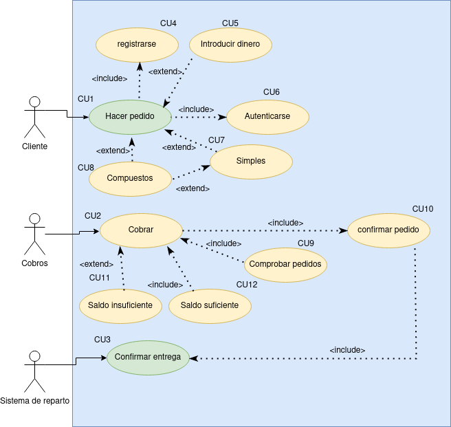

## Índice
  - [Introducción](#introducción).
  - [Descripción](#descripción).
  - [Especificación de actores](#especificación-de-actores).
  - [Especificación de casos de uso](#especificación-de-casos-de-uso-1).

### Introducción

  El presente documento especifica el __diagrama de casos de uso__ de la aplicación __Tienda Virtual__ solicitada por una empresa que quiere una tienda online.

### Descripción

  Lafinalidad de este proyecto es hacer una aplicación donde los clientes puedan hacer pedidos de dicha empresa y recibir el producto de forma comoda.

### Especificación de Actores

  En este documento se muestran los diferentes actores que utilizarán la aplicación.

### Cliente

| Actor | Cliente |
  |---|---|
  | Descripción  | Persona que acudira a la web a hacer pedidos  |
  | Características  | Podran ver la web, en caso de querer hacer un pedido tendran que registrarse y mas tarde autenticarse |
  | Relaciones |   |
  | Referencias | |   
  |  Notas |   |
  | Autor  | _Marlon Farizo Hergueta_ |
  |Fecha | _24/01/2023_ |

### Sistema de cobros

  | Actor | Cobros |
  |---|---|
  | Descripción  | Los encargados de comprobar los cobros que se hacen a fin de mes y cobrarlos |
  | Características  | Veran los pedidos, los cobraran y mandaran la orden a los repartidores |
  | Relaciones |   |
  | Referencias | |   
  |  Notas |   |
  | Autor  | _Marlon Farizo Hergueta_ |
  |Fecha | _24/01/2023_ |

### Sistema de reparto

  | Actor | Sistema de reparto |
  |---|---|
  | Descripción  | Se encarga de repartir el pedido |
  | Características  | Reparte el pedido y el sistema de cobros confirma que el pedido ha sido entregado |
  | Relaciones |   |
  | Referencias | |   
  |  Notas |   |
  | Autor  | _Marlon Farizo Hergueta_ |
  |Fecha | _24/01/2023_ |

### Especificación de Casos de uso

|  Caso de Uso	CU.1 | Hacer pedido |
|---|---|
| Fuentes  | El caso de uso se sustenta en [este documento](https://github.com/jpexposito/ets/tree/main/diagramas-comportamiento/diagramas-cu/tareas/tarea6).  |
| Actor  | Cliente  |
| Descripción | Se hace el pedido  |
| Flujo básico |  |
| Pre-condiciones | Debes registrarte para hacer el pedido y mas tarde autenticarte para completarlo |  
| Post-condiciones  | Puedes introducir dinero para hacer el pedido.
Los pedidos pueden ser simples o compuestos, que a su vez los compuestos pueden estar formados por pedidos simples y compuestos|  
|  Requerimientos | Registrarse y autenticarse |
|  Notas |  |
| Autor  | _Marlon Farizo Hergueta_ |
|Fecha | _24/01/23_ |

|  Caso de Uso	CU.2 | cobrar |
|---|---|
| Fuentes  | El caso de uso se sustenta en [este documento](https://github.com/jpexposito/ets/tree/main/diagramas-comportamiento/diagramas-cu/tareas/tarea6).  |
| Actor  | Cobros |
| Descripción | Cobrar a fin de mes todos los pedidos |
| Flujo básico |  |
| Pre-condiciones | Hay que comprobar los pedidos para poder cobrar y que el cliente tenga saldo en la cuenta |  
| Post-condiciones  | Una vez cobrado y entregado el pedido, se actualiza el estado del pedido a confirmado |  
|  Requerimientos | Tener saldo suficiente y confirmar el pedido |
|  Notas |  |
| Autor  | _Marlon Farizo Hergueta_ |
|Fecha | _24/01/23_ |

|  Caso de Uso	CU.3 | Confirmar entrega |
|---|---|
| Fuentes  | El caso de uso se sustenta en [este documento](https://github.com/jpexposito/ets/tree/main/diagramas-comportamiento/diagramas-cu/tareas/tarea6).  |
| Actor  | Sistema de reparto |
| Descripción | Se encarga de enviar los pedidos |
| Flujo básico |  |
| Pre-condiciones |  |  
| Post-condiciones  | Una vez entregado el producto, se confirma el pedido |  
|  Requerimientos |  |
|  Notas |  |
| Autor  | _Marlon Farizo Hergueta_ |
|Fecha | _24/01/23_ |

|  Caso de Uso	CU.4 | Registrarse |
|---|---|
| Fuentes  | El caso de uso se sustenta en [este documento](https://github.com/jpexposito/ets/tree/main/diagramas-comportamiento/diagramas-cu/tareas/tarea6).  |
| Actor  | Cliente  |
| Descripción | El cliente se registra para poder hacer un pedido |
| Flujo básico |  |
| Pre-condiciones |  |  
| Post-condiciones  | |  
|  Requerimientos |  |
|  Notas |  |
| Autor  | _Marlon Farizo Hergueta_ |
|Fecha | _24/01/23_ |

|  Caso de Uso	CU.5 | Introducit dinero |
|---|---|
| Fuentes  | El caso de uso se sustenta en [este documento](https://github.com/jpexposito/ets/tree/main/diagramas-comportamiento/diagramas-cu/tareas/tarea6).  |
| Actor  | Cliente |
| Descripción | Introducir dinero en la cuenta |
| Flujo básico |  |
| Pre-condiciones |  |  
| Post-condiciones  | |  
|  Requerimientos |  |
|  Notas |  |
| Autor  | _Marlon Farizo Hergueta_ |
|Fecha | _24/01/23_ |

|  Caso de Uso	CU.6 | Autenticarse |
|---|---|
| Fuentes  | El caso de uso se sustenta en [este documento](https://github.com/jpexposito/ets/tree/main/diagramas-comportamiento/diagramas-cu/tareas/tarea6).  |
| Actor  | Cliente  |
| Descripción | Autenticar su cuenta para poder hacer un pedido |
| Flujo básico |  |
| Pre-condiciones |  |  
| Post-condiciones  | |  
|  Requerimientos |  |
|  Notas |  |
| Autor  | _Marlon Farizo Herguetao_ |
|Fecha | _24/01/23_ |

|  Caso de Uso	CU.7 | Simples |
|---|---|
| Fuentes  | El caso de uso se sustenta en [este documento](https://github.com/jpexposito/ets/tree/main/diagramas-comportamiento/diagramas-cu/tareas/tarea6).  |
| Actor  | Cliente  |
| Descripción | Tipo del pedido |
| Flujo básico |  |
| Pre-condiciones |  |  
| Post-condiciones  | |  
|  Requerimientos |  |
|  Notas |  |
| Autor  | _Marlon Farizo Hergueta_ |
|Fecha | _24/01/23_ |

|  Caso de Uso	CU.8 | Compuestos |
|---|---|
| Fuentes  | El caso de uso se sustenta en [este documento](https://github.com/jpexposito/ets/tree/main/diagramas-comportamiento/diagramas-cu/tareas/tarea6).  |
| Actor  | Cliente  |
| Descripción | Tipo del pedido |
| Flujo básico |  |
| Pre-condiciones |  |  
| Post-condiciones  | |  
|  Requerimientos |  |
|  Notas |  |
| Autor  | _Marlon Farizo Hergueta_ |
|Fecha | _24/01/23_ |

|  Caso de Uso	CU.9 | Comprobar pedidos |
|---|---|
| Fuentes  | El caso de uso se sustenta en [este documento](https://github.com/jpexposito/ets/tree/main/diagramas-comportamiento/diagramas-cu/tareas/tarea6).  |
| Actor  | Cobros  |
| Descripción | Compueba los pedidos a fin de mes |
| Flujo básico |  |
| Pre-condiciones |  |  
| Post-condiciones  | |  
|  Requerimientos |  |
|  Notas |  |
| Autor  | _Marlon Farizo Hergueta_ |
|Fecha | _24/01/23_ |

|  Caso de Uso	CU.10 | Confirmar pedido |
|---|---|
| Fuentes  | El caso de uso se sustenta en [este documento](https://github.com/jpexposito/ets/tree/main/diagramas-comportamiento/diagramas-cu/tareas/tarea6).  |
| Actor  | Cobros  |
| Descripción | Actualizar el estado del pedido a confirmado una vez entregado |
| Flujo básico |  |
| Pre-condiciones | Confirmar el pedido |  
| Post-condiciones  | |  
|  Requerimientos |  |
|  Notas |  |
| Autor  | _Marlon Farizo Hergueta_ |
|Fecha | _24/01/23_ |

|  Caso de Uso	CU.11 | Saldo insuficiente |
|---|---|
| Fuentes  | El caso de uso se sustenta en [este documento](https://github.com/jpexposito/ets/tree/main/diagramas-comportamiento/diagramas-cu/tareas/tarea6).  |
| Actor  | Cobros  |
| Descripción | Se asegura si el cliente tiene saldo suficiente o no, en caso negativo se rechaza el pedido|
| Flujo básico |  |
| Pre-condiciones |  |  
| Post-condiciones  | |  
|  Requerimientos |  |
|  Notas |  |
| Autor  | _Marlon Farizo Hergueta_ |
|Fecha | _24/01/23_ |

|  Caso de Uso	CU.12 | Saldo suficiente |
|---|---|
| Fuentes  | El caso de uso se sustenta en [este documento](https://github.com/jpexposito/ets/tree/main/diagramas-comportamiento/diagramas-cu/tareas/tarea6).  |
| Actor  | Cobros  |
| Descripción | Se asegura que el cliente tiene saldo suficiente para hacer el pedido |
| Flujo básico |  |
| Pre-condiciones |  |  
| Post-condiciones  | una vez visto confirmado que tiene el saldo suficiente, se cobra el pedido realizado|  
|  Requerimientos |  |
|  Notas |  |
| Autor  | _Marlon Farizo Hergueta_ |
|Fecha | _24/01/23_ |