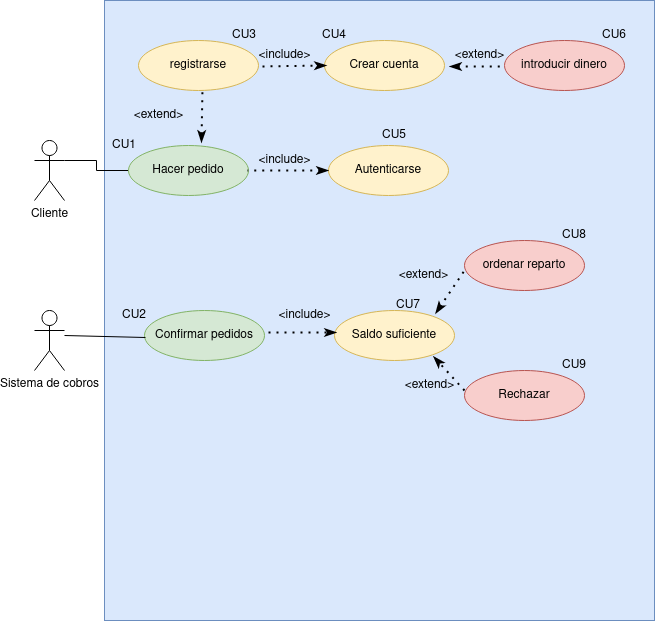

## Índice
  - [Introducción](#introducción).
  - [Descripción](#descripción).
  - [Especificación de actores](#especificación-de-actores).
  - [Especificación de casos de uso](#especificación-de-casos-de-uso).

### Introducción

  El presente documento especifica el __diagrama de casos de uso__ de la aplicación __Tienda Virtual__ solicitada por una empresa que quiere una tienda online.

### Descripción

  Lafinalidad de este proyecto es hacer una aplicación donde los clientes puedan hacer pedidos de dicha empresa y recibir el producto de forma comoda.

### Especificación de Actores

  En este documento se muestran los diferentes actores que utilizarán la aplicación.

### Cliente

| Actor | Cliente |
  |---|---|
  | Descripción  | Persona que acudira a la web a hacer pedidos  |
  | Características  | Podran ver la web, en caso de querer hacer un pedido tendran que registrarse y mas tarde autenticarse |
  | Relaciones |   |
  | Referencias | |   
  |  Notas |   |
  | Autor  | _Marlon Farizo Hergueta_ |
  |Fecha | _24/01/2023_ |

### Sistema de cobros

  | Actor | Cobros |
  |---|---|
  | Descripción  | Los encargados de comprobar los cobros que se hacen a fin de mes y cobrarlos |
  | Características  | Veran los pedidos, los cobraran y mandaran la orden a los repartidores |
  | Relaciones |   |
  | Referencias | |   
  |  Notas |   |
  | Autor  | _Marlon Farizo Hergueta_ |
  |Fecha | _24/01/2023_ |

### Especificación de Casos de uso

|  Caso de Uso	CU.1 | Hacer pedido |
|---|---|
| Fuentes  | El caso de uso se sustenta en [este documento](https://github.com/jpexposito/ets/tree/main/diagramas-comportamiento/diagramas-cu/tareas/tarea6).  |
| Actor  | Cliente  |
| Descripción | Se hace el pedido  |
| Flujo básico |  |
| Pre-condiciones | Debes registrarte para hacer el pedido, pero no debes hacerlo cada vez que quieras pedir algo, sin embargo hay que autenticarte cada vez que quieras hacer un pedido |  
| Post-condiciones  | |  
|  Requerimientos | Registrarse y autenticarse |
|  Notas |  |
| Autor  | _Marlon Farizo Hergueta_ |
|Fecha | _24/01/23_ |

|  Caso de Uso	CU.2 | Confirmar pedido |
|---|---|
| Fuentes  | El caso de uso se sustenta en [este documento](https://github.com/jpexposito/ets/tree/main/diagramas-comportamiento/diagramas-cu/tareas/tarea6).  |
| Actor  | Sistema de cobros |
| Descripción | Compueba los pedidos cada dia para realizar los cobros|
| Flujo básico |  |
| Pre-condiciones | Tienes que comprobar si tiene saldo suficiente en la cuenta para poder confimar el pedido |  
| Post-condiciones  | |  
|  Requerimientos | Tener saldo suficiente |
|  Notas |  |
| Autor  | _Marlon Farizo Hergueta_ |
|Fecha | _24/01/23_ |

|  Caso de Uso	CU.3 | Registrarse |
|---|---|
| Fuentes  | El caso de uso se sustenta en [este documento](https://github.com/jpexposito/ets/tree/main/diagramas-comportamiento/diagramas-cu/tareas/tarea6).  |
| Actor  | Cliente  |
| Descripción | El cliente se registra para poder hacer un pedido |
| Flujo básico |  |
| Pre-condiciones |  |  
| Post-condiciones  | Puedes registrarte para crear una o mas cuentas |  
|  Requerimientos |  |
|  Notas |  |
| Autor  | _Marlon Farizo Hergueta_ |
|Fecha | _24/01/23_ |

|  Caso de Uso	CU.4 | Crear cuenta |
|---|---|
| Fuentes  | El caso de uso se sustenta en [este documento](https://github.com/jpexposito/ets/tree/main/diagramas-comportamiento/diagramas-cu/tareas/tarea6).  |
| Actor  | Cliente |
| Descripción | El cliente puede tener una o mas cuentas con las que hacer los pedidos |
| Flujo básico |  |
| Pre-condiciones |  |  
| Post-condiciones  | Al crear la cuenta puedes introducir dinero en ella para hacer los pedidos |  
|  Requerimientos |  |
|  Notas |  |
| Autor  | _Marlon Farizo Hergueta_ |
|Fecha | _24/01/23_ |

|  Caso de Uso	CU.5 | Autenticarse |
|---|---|
| Fuentes  | El caso de uso se sustenta en [este documento](https://github.com/jpexposito/ets/tree/main/diagramas-comportamiento/diagramas-cu/tareas/tarea6).  |
| Actor  | Cliente  |
| Descripción | Autenticar su cuenta para poder hacer un pedido |
| Flujo básico |  |
| Pre-condiciones |  |  
| Post-condiciones  | Te autenticas cada vez que quieres hacer un pedido|  
|  Requerimientos |  |
|  Notas |  |
| Autor  | _Marlon Farizo Herguetao_ |
|Fecha | _24/01/23_ |

|  Caso de Uso	CU.6 | Introducir dinero |
|---|---|
| Fuentes  | El caso de uso se sustenta en [este documento](https://github.com/jpexposito/ets/tree/main/diagramas-comportamiento/diagramas-cu/tareas/tarea6).  |
| Actor  | Cliente  |
| Descripción | Introducir dinero en la cuenta |
| Flujo básico |  |
| Pre-condiciones | Crear una cuenta |  
| Post-condiciones  | |  
|  Requerimientos | Tener una cuenta donde introducir el dinero |
|  Notas |  |
| Autor  | _Marlon Farizo Hergueta_ |
|Fecha | _24/01/23_ |

|  Caso de Uso	CU.7 | Saldo suficiente |
|---|---|
| Fuentes  | El caso de uso se sustenta en [este documento](https://github.com/jpexposito/ets/tree/main/diagramas-comportamiento/diagramas-cu/tareas/tarea6).  |
| Actor  | Sistema de cobros  |
| Descripción | Hay que tener saldo suficiente para poder confirmar el pedido y luego ordenar el reparto, en caso negativo, se rechaza |
| Flujo básico |  |
| Pre-condiciones | |  
| Post-condiciones  | En caso de haber saldo suficiente, se ordena el reparto, en caso negativo, se rechaza|  
|  Requerimientos |  |
|  Notas |  |
| Autor  | _Marlon Farizo Hergueta_ |
|Fecha | _24/01/23_ |

|  Caso de Uso	CU.8 | Ordenar reparto |
|---|---|
| Fuentes  | El caso de uso se sustenta en [este documento](https://github.com/jpexposito/ets/tree/main/diagramas-comportamiento/diagramas-cu/tareas/tarea6).  |
| Actor  | Sistema de cobros  |
| Descripción | Se ordena el reparto, una vez confirmado el saldo|
| Flujo básico |  |
| Pre-condiciones | Tener saldo suficiente en la cuenta |  
| Post-condiciones  | |  
|  Requerimientos | Saldo suficiente |
|  Notas |  |
| Autor  | _Marlon Farizo Hergueta_ |
|Fecha | _24/01/23_ |

|  Caso de Uso	CU.9 | Rechazar |
|---|---|
| Fuentes  | El caso de uso se sustenta en [este documento](https://github.com/jpexposito/ets/tree/main/diagramas-comportamiento/diagramas-cu/tareas/tarea6).  |
| Actor  | Sistema de cobros  |
| Descripción | Se rechaza el pedido al no haber saldo suficiente |
| Flujo básico |  |
| Pre-condiciones | Que no se cumpla el saldo suficiente |  
| Post-condiciones  | |  
|  Requerimientos | Incumplimiento del saldo |
|  Notas |  |
| Autor  | _Marlon Farizo Hergueta_ |
|Fecha | _24/01/23_ |